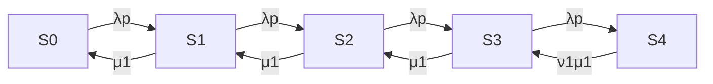

# Question 1
## (a)
From given data we know that
$$
\begin{matrix}
U(1)=\frac {B(1)}{T} = \frac{1015}{1800} \\X(0)=\frac{C(0)}{T}=\frac{67}{1800}
\end{matrix}
$$
therefore, apply the service demand law,
$$ D(1)=\frac{U(1)}{X(0)}\approx15.15s$$
## (b)
Consider both CPU cores and the disk are standalone devices{d(1),d(2),d(3)},  we know that
$$
X\le \min (\frac{1}{\max D_i},\frac{N}{\Sigma^3_{i=1}D_i})
$$
by service demand law, we have
$$ D_1=15.86,D_2=22.87,D_3=14.73 $$
by little's law, we have $$N_{avg}=R_{avg}*X_{avg}$$
and by interactive response time law, we have $$M=X(0)*(Z+R)$$
with M=19,Z=45 and X(0) from above, we have R=465.44, therefore N = 17.33.
with these known parameters, we have
$$X\le \min (\frac{1}{\max D_i},\frac{N}{\Sigma^3_{i=1}D_i})=\min(\frac{1}{22.87},\frac{17.33}{53.46})=0.043$$
the upper bound of throughput is 0.043 req/seq

## (c)
Since both cores have the same processing rate, to balance the utilization of the 2 cores, we aim to distribute the requests evenly between them, i.e. they have the same busy time. Hence, for balanced cores, $B_1=B_2=\frac{1015+1532}{2}=1273.5,D_1=D_2=19$, with the above formula we have the lowest upper bound $X_{upper}=0.052$
## (d)
In part c we considers all requests have the same response time. But requests can vary in their computational complexity, data amount or memory usage, therefore it's difficult to predict how long each request will take before distributing it to a CPU core. And even if we could estimate a request's execution time before distribution, the actual conditions during execution would affect the real execution time.
# Question 2
## (a)
the definition of the states and the transition rate in between are as below

| state index | trainee status | slot status  |
| ----------- | -------------- | ------------ |
| S0          | free           | 0/3 occupied |
| S1          | busy           | 0/3 occupied |
| S2          | busy           | 1/3 occupied |
| S3          | busy           | 2/3 occupied |
| S4          | busy           | 3/3 occupied |

## (b)

Define $P_i=probability\_in\_state\_i,i=0,1,2,3,4 $. We have 5 balance equations as below.
$$
\lambda pP_0 = \mu_1 P_1\\ 
\lambda pP_0+ \mu_1 P_2 = (\lambda p+\mu_1)P_1 \\
\lambda pP_1+ \mu_1 P_3 = (\lambda p+\mu_1)P_2 \\
\lambda pP_2+ \mu_1 \upsilon_1 P_4 = (\lambda p+\mu_1)P_3 \\
\lambda pP_3 = \mu_1 \upsilon_1 P_4
$$

## (C)

Besides the balance equations above, we have $\Sigma^4_{i=0}P_i=1$. Simplify the above system of equations, we have
$$
\left\{
\begin{array}{**lr**}
\lambda pP_0=\mu_1P_1\\
\lambda pP_1=\mu_1P_2\\
\lambda pP_2=\mu_1P_3\\
\lambda pP_3=\mu_1\upsilon_1 P_4\\
\end{array}
\right.
\Rightarrow
\left\{
\begin{array}{**lr**}
P_0=\frac{\mu_1}{\lambda p}P_1\\
P_1=\frac{\mu_1}{\lambda p}P_2\\
P_2=\frac{\mu_1}{\lambda p}P_3\\
P_3=\frac{\mu_1}{\lambda p}\upsilon_1 P_4\\
\end{array}
\right.
\Rightarrow
\left\{
\begin{array}{**lr**}
P_0=\left(\frac{\mu_1}{\lambda p}\right)^4  \upsilon_1 P_4\\
P_1=\left(\frac{\mu_1}{\lambda p}\right)^3  \upsilon_1 P_4\\
P_2=\left(\frac{\mu_1}{\lambda p}\right)^2  \upsilon_1 P_4\\
P_3=\frac{\mu_1}{\lambda p}\upsilon_1 P_4\\
\end{array}
\right.
$$
combine this with $\Sigma^4_{i=0}P_i=1$, we have
$$
\left\{
\begin{array}{**lr**}
P_0=\frac{\left(\frac{\mu_1}{\lambda p}\right)^4 \upsilon_1}{1+\frac{\mu_1}{\lambda p}\upsilon_1+\left(\frac{\mu_1}{\lambda p}\right)^2 \upsilon_1+\left(\frac{\mu_1}{\lambda p}\right)^3\upsilon_1+\left(\frac{\mu_1}{\lambda p}\right)^4\upsilon_1}\\
P_1=\frac{\left(\frac{\mu_1}{\lambda p}\right)^3 \upsilon_1}{1+\frac{\mu_1}{\lambda p}\upsilon_1+\left(\frac{\mu_1}{\lambda p}\right)^2 \upsilon_1+\left(\frac{\mu_1}{\lambda p}\right)^3\upsilon_1+\left(\frac{\mu_1}{\lambda p}\right)^4\upsilon_1}\\
P_2=\frac{\left(\frac{\mu_1}{\lambda p}\right)^2 \upsilon_1}{1+\frac{\mu_1}{\lambda p}\upsilon_1+\left(\frac{\mu_1}{\lambda p}\right)^2 \upsilon_1+\left(\frac{\mu_1}{\lambda p}\right)^3\upsilon_1+\left(\frac{\mu_1}{\lambda p}\right)^4\upsilon_1}\\
P_3=\frac{\frac{\mu_1}{\lambda p}\upsilon_1}{1+\frac{\mu_1}{\lambda p}\upsilon_1+\left(\frac{\mu_1}{\lambda p}\right)^2 \upsilon_1+\left(\frac{\mu_1}{\lambda p}\right)^3\upsilon_1+\left(\frac{\mu_1}{\lambda p}\right)^4\upsilon_1}\\
P_4=\frac{1}{1+\frac{\mu_1}{\lambda p}\upsilon_1+\left(\frac{\mu_1}{\lambda p}\right)^2 \upsilon_1+\left(\frac{\mu_1}{\lambda p}\right)^3\upsilon_1+\left(\frac{\mu_1}{\lambda p}\right)^4\upsilon_1}\\
\end{array}
\right.
$$

## (d)

A call dispatched to Trainee 1 will be rejected only when the system is at state S4, there fore the probability under given values is P=P4=0.06

## (e)

Apply the given values, we have 

- Trainee 1

| state index | trainee status | slot status  | Probability(approximate) |
| ----------- | -------------- | ------------ | ------------------------ |
| S0          | free           | 0/3 occupied | 0.42                     |
| S1          | busy           | 0/3 occupied | 0.26                     |
| S2          | busy           | 1/3 occupied | 0.16                     |
| S3          | busy           | 2/3 occupied | 0.10                     |
| S4          | busy           | 3/3 occupied | 0.06                     |

the mean number of calls $N=\Sigma^3_{k=0}kP_k = 1.13$, mean service time $MS = \frac{1}{\mu_1}=0.26$, throughput $Ts = \lambda p=2.39$, apply Little's law, we have mean response time $R = \frac{N}{Ts}=0.47$, mean waiting time $W_1=R-MS=0.21$

- Trainee 2

| state index | trainee status | slot status  | Probability(approximate) |
| ----------- | -------------- | ------------ | ------------------------ |
| S0          | free           | 0/3 occupied | 0.27                     |
| S1          | busy           | 0/3 occupied | 0.22                     |
| S2          | busy           | 1/3 occupied | 0.19                     |
| S3          | busy           | 2/3 occupied | 0.16                     |
| S4          | busy           | 3/3 occupied | 0.16                     |

the mean number of calls $N=\Sigma^3_{k=0}kP_k = 1.72$, mean service time $MS = \frac{1}{\mu_2}=0.29$, throughput $Ts = \lambda (1-p)=2.92$, apply Little's law, we have mean response time $R = \frac{N}{Ts}=0.59$, mean waiting time $W_2=R-MS=0.30$

The mean waiting time of the queries that have not been rejected by the call centre is $MW = p*W_1+(1-p)*W_2=0.26$
