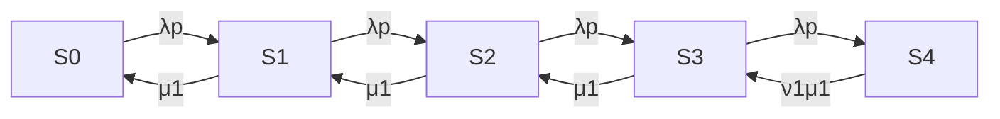

# Question 1
## (a)
From given data we know that
$$
\begin{matrix}
U(1)=\frac {B(1)}{T} = \frac{1015}{1800} \\X(0)=\frac{C(0)}{T}=\frac{67}{1800}
\end{matrix}
$$
therefore, apply the service demand law,
$$ D(1)=\frac{U(1)}{X(0)}\approx15.15s$$
## (b)
Consider both CPU cores and the disk are standalone devices{d(1),d(2),d(3)},  we know that
$$
X\le \min (\frac{1}{\max D_i},\frac{N}{\Sigma^3_{i=1}D_i})
$$
by service demand law, we have
$$ D_1=15.86,D_2=22.87,D_3=14.73 $$
by little's law, we have $$N_{avg}=R_{avg}*X_{avg}$$
and by interactive response time law, we have $$M=X(0)*(Z+R)$$
with M=19,Z=45 and X(0) from above, we have R=465.44, therefore N = 17.33.
with these known parameters, we have
$$X\le \min (\frac{1}{\max D_i},\frac{N}{\Sigma^3_{i=1}D_i})=\min(\frac{1}{22.87},\frac{17.33}{53.46})=0.043$$
the upper bound of throughput is 0.043 req/seq

## (c)
Since both cores have the same processing rate, to balance the utilization of the 2 cores, we aim to distribute the requests evenly between them, i.e. they have the same busy time. Hence, for balanced cores, $B_1=B_2=\frac{1015+1532}{2}=1273.5,D_1=D_2=19$, with the above formula we have the lowest upper bound $X_{upper}=0.052$
## (d)
In part c we considers all requests have the same response time. But requests can vary in their computational complexity, data amount or memory usage, therefore it's difficult to predict how long each request will take before distributing it to a CPU core. And even if we could estimate a request's execution time before distribution, the actual conditions during execution would affect the real execution time.
# Question 2
## (a)
the definition of the states and the transition rate in between are as below

| state index | trainee status | slot status  |
| ----------- | -------------- | ------------ |
| S0          | free           | 0/3 occupied |
| S1          | busy           | 0/3 occupied |
| S2          | busy           | 1/3 occupied |
| S3          | busy           | 2/3 occupied |
| S4          | busy           | 3/3 occupied |



## (b)

Define $P_i=probability\_in\_state\_i,i=0,1,2,3,4 $. We have 5 balance equations as below.
$$
\lambda pP_0 = \mu_1 P_1\\ 
\lambda pP_0+ \mu_1 P_2 = (\lambda p+\mu_1)P_1 \\
\lambda pP_1+ \mu_1 P_3 = (\lambda p+\mu_1)P_2 \\
\lambda pP_2+ \mu_1 \upsilon_1 P_4 = (\lambda p+\mu_1)P_3 \\
\lambda pP_3 = \mu_1 \upsilon_1 P_4
$$

## (C)

Besides the balance equations above, we have $\Sigma^4_{i=0}P_i=1$. Simplify the above system of equations, we have
$$
\left\{
\begin{array}{**lr**}
\lambda pP_0=\mu_1P_1\\
\lambda pP_1=\mu_1P_2\\
\lambda pP_2=\mu_1P_3\\
\lambda pP_3=\mu_1\upsilon_1 P_4\\
\end{array}
\right.
\Rightarrow
\left\{
\begin{array}{**lr**}
P_0=\frac{\mu_1}{\lambda p}P_1\\
P_1=\frac{\mu_1}{\lambda p}P_2\\
P_2=\frac{\mu_1}{\lambda p}P_3\\
P_3=\frac{\mu_1}{\lambda p}\upsilon_1 P_4\\
\end{array}
\right.
\Rightarrow
\left\{
\begin{array}{**lr**}
P_0=\left(\frac{\mu_1}{\lambda p}\right)^4  \upsilon_1 P_4\\
P_1=\left(\frac{\mu_1}{\lambda p}\right)^3  \upsilon_1 P_4\\
P_2=\left(\frac{\mu_1}{\lambda p}\right)^2  \upsilon_1 P_4\\
P_3=\frac{\mu_1}{\lambda p}\upsilon_1 P_4\\
\end{array}
\right.
$$
combine this with $\Sigma^4_{i=0}P_i=1$, we have
$$
\left\{
\begin{array}{**lr**}
P_0=\frac{\left(\frac{\mu_1}{\lambda p}\right)^4 \upsilon_1}{1+\frac{\mu_1}{\lambda p}\upsilon_1+\left(\frac{\mu_1}{\lambda p}\right)^2 \upsilon_1+\left(\frac{\mu_1}{\lambda p}\right)^3\upsilon_1+\left(\frac{\mu_1}{\lambda p}\right)^4\upsilon_1}\\
P_1=\frac{\left(\frac{\mu_1}{\lambda p}\right)^3 \upsilon_1}{1+\frac{\mu_1}{\lambda p}\upsilon_1+\left(\frac{\mu_1}{\lambda p}\right)^2 \upsilon_1+\left(\frac{\mu_1}{\lambda p}\right)^3\upsilon_1+\left(\frac{\mu_1}{\lambda p}\right)^4\upsilon_1}\\
P_2=\frac{\left(\frac{\mu_1}{\lambda p}\right)^2 \upsilon_1}{1+\frac{\mu_1}{\lambda p}\upsilon_1+\left(\frac{\mu_1}{\lambda p}\right)^2 \upsilon_1+\left(\frac{\mu_1}{\lambda p}\right)^3\upsilon_1+\left(\frac{\mu_1}{\lambda p}\right)^4\upsilon_1}\\
P_3=\frac{\frac{\mu_1}{\lambda p}\upsilon_1}{1+\frac{\mu_1}{\lambda p}\upsilon_1+\left(\frac{\mu_1}{\lambda p}\right)^2 \upsilon_1+\left(\frac{\mu_1}{\lambda p}\right)^3\upsilon_1+\left(\frac{\mu_1}{\lambda p}\right)^4\upsilon_1}\\
P_4=\frac{1}{1+\frac{\mu_1}{\lambda p}\upsilon_1+\left(\frac{\mu_1}{\lambda p}\right)^2 \upsilon_1+\left(\frac{\mu_1}{\lambda p}\right)^3\upsilon_1+\left(\frac{\mu_1}{\lambda p}\right)^4\upsilon_1}\\
\end{array}
\right.
$$


## (d)

A call dispatched to Trainee 1 will be rejected only when the system is at state S4, there fore the probability under given values is P=P4=0.06

## (e)

Apply the given values, we have 

- Trainee 1

| state index | trainee status | slot status  | Probability(approximate) |
| ----------- | -------------- | ------------ | ------------------------ |
| S0          | free           | 0/3 occupied | 0.42                     |
| S1          | busy           | 0/3 occupied | 0.26                     |
| S2          | busy           | 1/3 occupied | 0.16                     |
| S3          | busy           | 2/3 occupied | 0.10                     |
| S4          | busy           | 3/3 occupied | 0.06                     |

the mean number of calls $N=\Sigma^3_{k=0}kP_k = 1.13$, mean service time $MS = \frac{1}{\mu_1}=0.26$, throughput $Ts = \lambda p=2.39$, apply Little's law, we have mean response time $R = \frac{N}{Ts}=0.47$, mean waiting time $W_1=R-MS=0.21$


- Trainee 2

| state index | trainee status | slot status  | Probability(approximate) |
| ----------- | -------------- | ------------ | ------------------------ |
| S0          | free           | 0/3 occupied | 0.27                     |
| S1          | busy           | 0/3 occupied | 0.22                     |
| S2          | busy           | 1/3 occupied | 0.19                     |
| S3          | busy           | 2/3 occupied | 0.16                     |
| S4          | busy           | 3/3 occupied | 0.16                     |

the mean number of calls $N=\Sigma^3_{k=0}kP_k = 1.72$, mean service time $MS = \frac{1}{\mu_2}=0.29$, throughput $Ts = \lambda (1-p)=2.92$, apply Little's law, we have mean response time $R = \frac{N}{Ts}=0.59$, mean waiting time $W_2=R-MS=0.30$

The mean waiting time of the queries that have not been rejected by the call centre is $MW = p*W_1+(1-p)*W_2=0.26$

> the numerical value is derived with calc.py

# Question 3

## (a)

The states are defined as follows.

| state index | state tuple |
| ----------- | ----------- |
| 0           | (0,0,0,0)   |
| 1           | (1,0,0,0)   |
| 2           | (1,0,0,1)   |
| 3           | (2,0,0,0)   |
| 4           | (2,0,1,0)   |
| 5           | (2,0,0,1)   |
| 6           | (2,0,1,1)   |
| 7           | (0,1,0,0)   |
| 8           | (0,1,1,0)   |
| 9           | (0,1,0,1)   |
| 10          | (0,1,1,1)   |

The transition rates between states are as follows.

| from\to | 0       | 1           | 2           | 3           | 4           | 5           | 6           | 7           | 8           | 9           | 10          |
| ------- | ------- | ----------- | ----------- | ----------- | ----------- | ----------- | ----------- | ----------- | ----------- | ----------- | ----------- |
| 0       |         | $\lambda_1$ |             |             |             |             |             | $\lambda_2$ |             |             |             |
| 1       | $\mu_1$ |             | $\lambda_2$ | $\lambda_1$ |             |             |             |             |             |             |             |
| 2       |         |             |             |             |             | $\lambda_1$ |             | $\mu_1$     |             |             |             |
| 3       |         | $\mu_1$     |             |             | $\lambda_1$ | $\lambda_2$ |             |             |             |             |             |
| 4       |         |             |             | $\mu_1$     |             |             | $\lambda_2$ |             |             |             |             |
| 5       |         |             | $\mu_1$     |             |             |             | $\lambda_1$ |             |             |             |             |
| 6       |         |             |             |             |             | $\mu_1$     |             |             |             |             |             |
| 7       | $\mu_2$ |             |             |             |             |             |             |             | $\lambda_1$ | $\lambda_2$ |             |
| 8       |         | $\mu_2$     |             |             |             |             |             |             |             |             | $\lambda_2$ |
| 9       |         |             |             |             |             |             |             | $\mu_2$     |             |             | $\lambda_1$ |
| 10      |         |             | $\mu_2$     |             |             |             |             |             |             |             |             |

## (b)

### (i)

Define $P_i=probability\_in\_state\_i,i=0,1,...,10 $,with the states definition and transition rates above, we have the balance equations as below.
$$
\begin{align}
\lambda_1P_0+\lambda_2P_0 &= \mu_1P_1 + \mu_2P_7 \\
\mu_1P_1+\lambda_2P_1 + \lambda_1P_1&= \lambda_1P_0+\mu_1P_3+\mu_2P_8\\
\lambda_1P_2+\mu_1P_2 &= \lambda_2P_1 + \mu_1P_5+\mu_2P_{10} \\
\mu_1P_3+\lambda_1P_3+\lambda_2P_3 &= \lambda_1P_1 + \mu_1P_4 \\
\mu_1P_4+\lambda_2P_4 &=\lambda_1P_3\\
\mu_1P_5+\lambda_1P_5 &= \lambda_1P_2+\lambda_2P_3 +\mu_1P_6 \\
\mu_1P_6 &= \lambda_2P_4+\lambda_1P_5 \\
\mu_2P_7+\lambda_1P_7+\lambda_2P_7 &= \lambda_2P_0 + \mu_1P_2+\mu_2P_9 \\
\mu_2P_8+\lambda_2P_8 &= \lambda_1P_7 \\
\mu_2P_9+\lambda_1P_9 &= \lambda_2P_7 \\
\mu_2P_{10} &= \lambda_2P_8+\lambda_1P_9\\
\end{align}
$$
Then we have the system of equations $AP=0$, where $P=(P_0,P_1,P_2,...,P_{10})^T$, the coefficient matrix A is as below.
$$
A=\begin{pmatrix}
\lambda_1+\lambda_2 &-\mu_1&0&0&0&0&0&-\mu_2&0&0&0\\
-\lambda_1&\mu_1+\lambda_1+\lambda_2 &0&-\mu_1&0&0&0&0&-\mu_2&0&0\\
0&-\lambda_2&\mu_1+\lambda_1&0&0&-\mu_1&0&0&0&0&-\mu_2\\
0&-\lambda_1&0&\mu_1+\lambda_1+\lambda_2&-\mu_1&0&0&0&0&0&0&\\
0&0&0&-\lambda_1&\mu_1+\lambda_2&0&0&0&0&0&0\\
0&0&-\lambda_1&-\lambda_2&0&\mu_1+\lambda_1&-\mu_1&0&0&0&0\\
0&0&0&0&-\lambda_2&-\lambda_1&\mu_1&0&0&0&0\\
-\lambda_2&0&-\mu_1&0&0&0&0&\mu_2+\lambda_1+\lambda_2&0&-\mu_2&0\\
0&0&0&0&0&0&0&-\lambda_1&\mu_2+\lambda_2&0&0&\\
0&0&0&0&0&0&0&-\lambda_2&0&\mu_2+\lambda_1&0\\
0&0&0&0&0&0&0&0&-\lambda_2&-\lambda_1&\mu_2
\end{pmatrix}
$$
we use python to derive the numerical answers of this system of equations, the code we use is listed below.

```python
#derive.py
import numpy as np
l1=0.9
l2=0.2
m1=2.4
m2=0.8
coefficient = [
    [l1+l2,-m1,0,0,0,0,0,-m2,0,0,0],
    [-l1,m1+l1+l2,0,-m1,0,0,0,0,-m2,0,0],
    [0,-l2,m1+l1,0,0,-m1,0,0,0,0,-m2],
    [0,-l1,0,m1+l1+l2,-m1,0,0,0,0,0,0],
    [0,0,0,-l1,m1+l2,0,0,0,0,0,0],
    [0,0,-l1,-l2,0,m1+l1,-m1,0,0,0,0],
    [0,0,0,0,-l2,-l1,m1,0,0,0,0],
    [-l2,0,-m1,0,0,0,0,m2+l1+l2,0,-m2,0],
    [0,0,0,0,0,0,0,-l1,m2+l2,0,0],
    [0,0,0,0,0,0,0,-l2,0,m2+l1,0],
    [0,0,0,0,0,0,0,0,-l2,-l1,m2],
    [1,1,1,1,1,1,1,1,1,1,1]
]
A = np.array(coefficient)
P = np.array([0,0,0,0,0,0,0,0,0,0,0,1])
x = np.linalg.lstsq(A,P,rcond=None)
x0 = x[0]
print(x0)
print(sum(x0))
# output:
# [0.45686863 0.17800891 0.03278415 0.06002029 0.02077626 0.0190271
# 0.00886652 0.09416764 0.08475088 0.01107855 0.03365108]
# 1.0
```

It's easy to figure out that the coefficient matrix A is a singular matrix, in order to compute the numerical answer, we take $\Sigma^{10}_{i=0}P_i=1$ into consideration. So the equations we end up solving are
$$
\left(
\begin{array}{**lr**}
A\\
B
\end{array}
\right)
P=C
$$
where $B=(1,1,1,1,1,1,1,1,1,1,1)$, $C=(0,0,0,0,0,0,0,0,0,0,0,1)$. Now, this set of equations has turned into a non-homogeneous over-determined system of linear equations. We use the least squares method to try solving this system of equations. The result obtained is $P=(0.46,0.18,0.03,0.06,0.02,0.02,0.01,0.09,0.09,0.01,0.03)$.

To verify the accuracy of the numerical calculation, we adopt another method to solve this system of equations. By introducing an shadow variable $P_{11}=0$, the equation is transformed into the following form:
$$
\left(
\begin{array}{**lr**}
A &1\\
1&1
\end{array}
\right)
\left(
\begin{array}{**lr**}
P\\
0
\end{array}
\right)=C
$$
the code is listed below.

```python
# derive_pad.py
import numpy as np
l1=0.9
l2=0.2
m1=2.4
m2=0.8
coefficient1 = [
    [l1+l2,-m1,0,0,0,0,0,-m2,0,0,0,1],
    [-l1,m1+l1+l2,0,-m1,0,0,0,0,-m2,0,0,1],
    [0,-l2,m1+l1,0,0,-m1,0,0,0,0,-m2,1],
    [0,-l1,0,m1+l1+l2,-m1,0,0,0,0,0,0,1],
    [0,0,0,-l1,m1+l2,0,0,0,0,0,0,1],
    [0,0,-l1,-l2,0,m1+l1,-m1,0,0,0,0,1],
    [0,0,0,0,-l2,-l1,m1,0,0,0,0,1],
    [-l2,0,-m1,0,0,0,0,m2+l1+l2,0,-m2,0,1],
    [0,0,0,0,0,0,0,-l1,m2+l2,0,0,1],
    [0,0,0,0,0,0,0,-l2,0,m2+l1,0,1],
    [0,0,0,0,0,0,0,0,-l2,-l1,m2,1],
    [1,1,1,1,1,1,1,1,1,1,1,1]
]
A_1 = np.array(coefficient1)
x = np.linalg.solve(A_1,P)
print(x)
print(sum(x))
# output:
#[ 4.56868625e-01  1.78008906e-01  3.27841493e-02  6.00202939e-02
#  2.07762556e-02  1.90271018e-02  8.86651779e-03  9.41676422e-02
#  8.47508780e-02  1.10785461e-02  3.36510839e-02 -1.32469793e-17]
#1.0

```

The results from both methods are consistent. Therefore we have:

| state index | state tuple | probability |
| ----------- | ----------- | ----------- |
| 0           | (0,0,0,0)   | 0.46        |
| 1           | (1,0,0,0)   | 0.18        |
| 2           | (1,0,0,1)   | 0.03        |
| 3           | (2,0,0,0)   | 0.06        |
| 4           | (2,0,1,0)   | 0.02        |
| 5           | (2,0,0,1)   | 0.02        |
| 6           | (2,0,1,1)   | 0.01        |
| 7           | (0,1,0,0)   | 0.09        |
| 8           | (0,1,1,0)   | 0.09        |
| 9           | (0,1,0,1)   | 0.01        |
| 10          | (0,1,1,1)   | 0.03        |

### (ii)

Arriving Type 2 requests will be rejected in the following states:[2,5,6,9,10], so the probability is $P(rej\_T_2)=P_2+P_5+P_6+P_9+P_{10}=0.1$.

### (iii)

In this case, the mean waiting time of Type 2 requests is:
$$
MW= \Sigma^{10}_{i=0}P_imw_i
$$
 where $mw_i$ is the mean waiting time of Type 2 requests at state i. We know that mean_waiting_time = mean_response_time - mean_service_time, apply this formula to every state, we have:
$$
mw = (0,0,\frac{1}{\mu_1},0,0,\frac{1}{\mu_1}\times2,\frac{1}{\mu_1}\times3,0,0,\frac{1}{\mu_2},\frac{1}{\mu_1}+\frac{1}{\mu_2})
$$
there fore, $MW = P \times mw^T = $0.10


