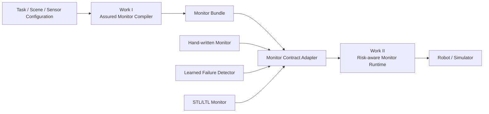
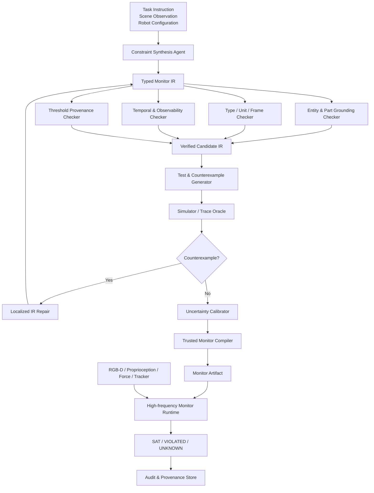
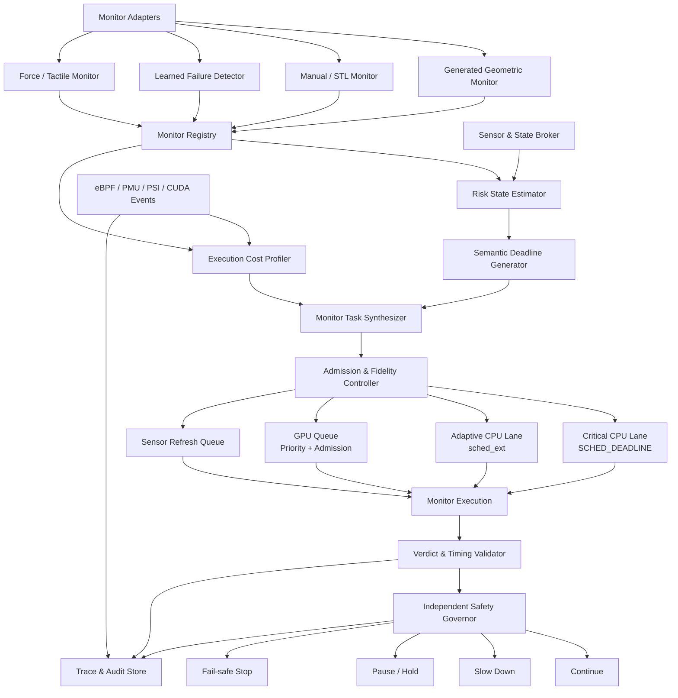
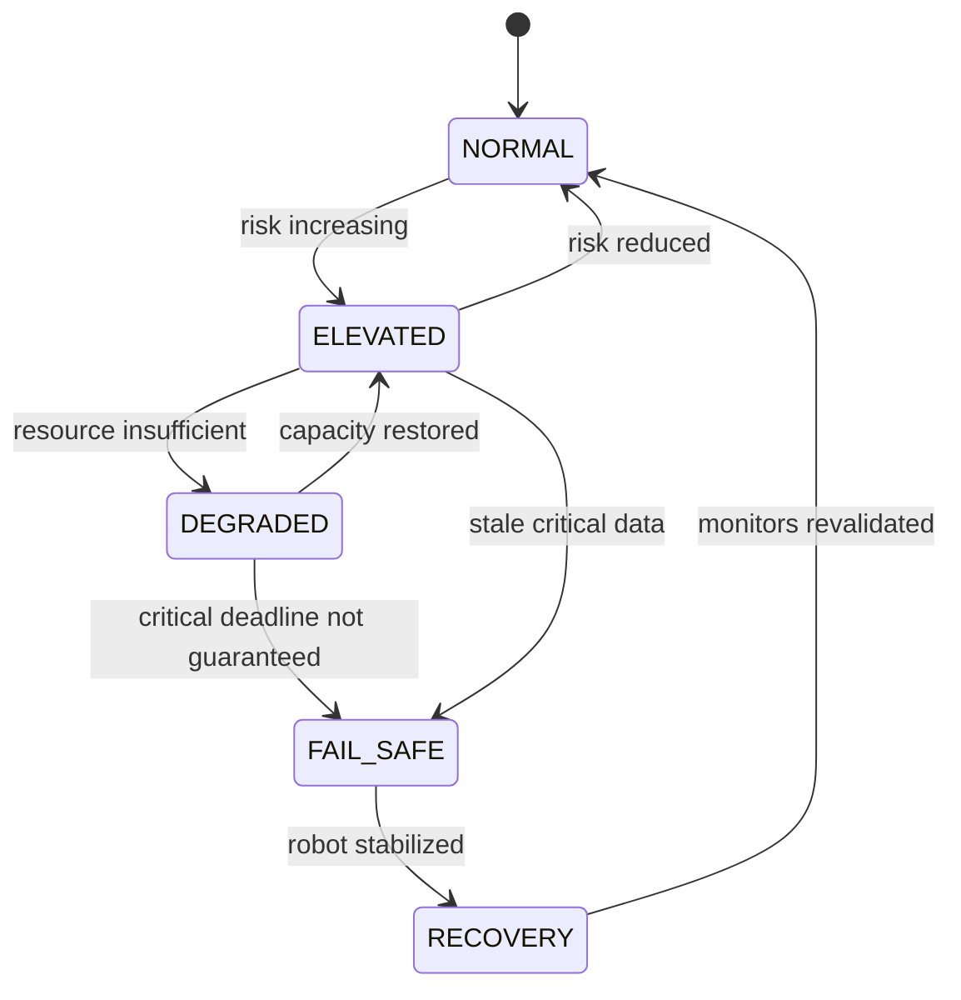

# **总体设计**

这两项工作应围绕两个不同的可信性维度展开：

\text{机器人监控可信性}
=
\underbrace{\text{语义与判定可信性}}_{\text{工作一}}
+
\underbrace{\text{执行时效可信性}}_{\text{工作二}}

CaM 当前采用 **Constraint Generator—Constraint Painter—Constraint Monitor** 三段式流程：VLM 生成子目标和约束，Painter 将相关对象或部件抽象成三维点、线、面，Monitor 再生成 NumPy 风格代码，使用 CoTracker 跟踪约束元素，并根据预设阈值返回布尔结果和故障原因。 

新的两项工作分别替换 CaM 中的两个隐含假设：

| **CaM 的隐含假设**          | **对应问题**                      | **新工作**       |
| ---------------------- | ----------------------------- | ------------- |
| VLM 生成的 monitor 可以直接信任 | 可能绑定错对象、使用错坐标系、阈值不合理、对噪声过度确定  | 工作一：可信监控编译    |
| monitor 只要足够轻量就能及时执行   | CPU/GPU 竞争、相机掉帧、数据过期可能使报警失去意义 | 工作二：风险驱动实时运行时 |

建议暂定名称：

- **工作一：AssuredCaM——面向开放机器人任务的可信与不确定性感知监控编译**
- **工作二：Semantic Deadlines——面向机器人监控程序的风险驱动实时运行时**

---

# **一、两项工作的公共基础**

两篇论文可以共享一个很薄的基础设施，但不能形成强依赖。



## **1. 公共接口：Monitor Contract SDK**

公共接口只描述监控器是什么、如何调用，不规定它如何生成或如何调度。

建议拆成三个独立对象。

### 

### **1.1**

**`SemanticMonitorSpec`**

描述监控语义，由工作一产生，也可以人工编写。

```yaml
monitor_id: keep_pan_level
version: 1

scope:
  phase: transfer_pan
  temporal_operator: always

entities:
  subject:
    instance: pan
    part: inner_surface
    geometry_type: plane

reference:
  frame: world
  axis: z

predicate:
  operator: angle_less_than
  lhs: normal(subject)
  rhs: reference.axis
  threshold:
    value: 8.0
    unit: degree
    provenance: task_template

observation:
  required_modalities:
    - rgbd
  required_views:
    - front
    - top

severity: safety_critical
fallback: slow_and_stabilize
```

### 

### **1.2**

**`MonitorVerdict`**

描述一次监控执行结果。

```yaml
monitor_id: keep_pan_level
timestamp_ns: 19238823893

verdict: UNKNOWN          # SAT / VIOLATED / UNKNOWN
robustness_interval:
  lower: -1.3
  upper: 2.1
  unit: degree

evidence:
  estimated_angle: 7.4
  observation_age_ms: 18.2
  occlusion_ratio: 0.37

reason_code: INTERVAL_CROSSES_BOUNDARY
reason_text: normal estimation is uncertain due to partial occlusion
```

### 

### **1.3**

**`MonitorExecutionProfile`**

由工作二通过 profiling 产生，不应由工作一硬编码。

```yaml
monitor_id: keep_pan_level

fidelity_levels:
  - id: low
    views: 1
    tracker_points: 3
    cpu_budget_us: 500
    gpu_budget_us: 0
    expected_error: 2.5

  - id: medium
    views: 2
    tracker_points: 12
    cpu_budget_us: 1200
    gpu_budget_us: 2500
    expected_error: 1.1

  - id: high
    views: 2
    refresh_segmentation: true
    cpu_budget_us: 2500
    gpu_budget_us: 18000
    expected_error: 0.4
```

## **2. 公共工程原则**

公共 SDK 应保持：

- 版本化 schema；
- 固定错误码；
- 可序列化、可回放；
- 不依赖 ROS 2；
- 控制面可使用 Protobuf/JSON；
- 高频数据面使用共享内存或固定结构体；
- 每个 monitor artifact 必须有哈希、版本、生成记录和校准记录。

建议建立三个仓库或三个顶层目录：

```text
monitor-contract/
  schema/
  cpp-sdk/
  python-sdk/
  examples/

assured-cam/
  compiler/
  verifier/
  uncertainty/
  runtime/
  benchmark/

semantic-deadlines/
  adapters/
  profiler/
  risk/
  admission/
  scheduler/
  governor/
  tracing/
```

---

# **二、工作一：AssuredCaM**

## **1. 论文定位**

### **1.1 核心问题**

如何将开放式机器人任务编译为经过结构化检查、反例测试和不确定性校准的运行时监控程序？

该工作不解决资源竞争，不讨论 CPU/GPU 调度，只研究：

1. monitor 是否表达了正确的约束；
2. monitor 是否使用了正确对象、部件、坐标系和单位；
3. monitor 是否实现了正确的时间语义；
4. monitor 是否对感知不确定性给出合理判定；
5. monitor 代码是否忠实实现了规范。

### **1.2 预期论文主张**

不应声称“证明 VLM 完全理解了自然语言任务”，而应采用更准确的表述：

AssuredCaM 提供 **contract-relative assurance**：在给定结构化约束规范和观测模型的前提下，系统保证生成的运行时程序满足类型、单位、坐标系、可观测性和执行语义要求，并对感知不确定性给出校准后的选择性判定。

---

## **2. 总体架构**



---

## **3. 可信边界设计**

工作一必须明确 Trusted Computing Base，不能笼统地把整个系统称为可信。

### **3.1 不可信组件**

以下组件全部视为可能出错：

- VLM；
- 视觉分割模型；
- 对象和部件接地模型；
- 深度估计；
- 跟踪器；
- VLM 生成的阈值；
- 原始自然语言解释；
- 自动修复模型。

### **3.2 可信核心**

可信核心尽量小，只包括：

- Monitor IR schema；
- 类型、单位和坐标系检查器；
- 有限时序语义解释器；
- 受限算子库；
- IR 到运行时代码的编译器；
- 不确定性区间传播逻辑；
- 校准结果验证器；
- verdict 状态机。

这一区分本身应成为论文方法设计的一部分。

---

## **4. 核心模块设计**

## **4.1 Constraint Synthesis Agent**

输入：

- 全局任务；
- 当前子目标；
- 场景观测；
- 机器人和传感器配置；
- 可用谓词和几何元素库；
- 之前的监控反馈。

输出不是 Python，而是候选 `Typed Monitor IR`。

生成过程建议使用两阶段方案：

### **阶段 A：语义约束生成**

生成：

- 哪些状态需要持续保持；
- 哪些状态只需要在子目标结束时满足；
- 哪些约束是安全关键；
- 违反后应该停止、减速还是重规划。

### **阶段 B：可观测谓词实例化**

将约束映射为：

- 实体；
- 部件；
- 点、线、面或姿态；
- 参考系；
- 传感器；
- 数值谓词；
- 阈值来源；
- 时间作用域。

不得允许模型自由添加任意函数调用。

---

## **4.2 Typed Monitor IR**

建议采用受限的、可增量解释的 DSL。

### **基础类型**

```text
Scalar
Length
Angle
Time
Velocity
Point3D<Frame>
Vector3D<Frame>
Line3D<Frame>
Plane3D<Frame>
Pose<Frame>
Region3D<Frame>
Contact
Force
Boolean
```

### **基础算子**

```text
distance
angle
normal
inside
overlap
relative_pose
displacement
velocity
contact_exists
force_norm
```

### **时间算子**

第一版不要实现完整 LTL/STL，只实现机器人监控所需的有界子集：

```text
always_during(phase, predicate)
at_completion(phase, predicate)
eventually_within(duration, predicate)
maintain_for(duration, predicate)
until(predicate_a, predicate_b)
change_within(window, lower, upper)
```

受限语法便于：

- 在线增量计算；
- 静态分析；
- 有界内存；
- 自动测试；
- 生成有限状态监控器。

SafeManip 已使用 LTLf 模板评价机器人操作轨迹中的时间安全属性，因此工作一不能把“使用时序逻辑”作为创新本身；区别必须落在开放场景接地、受限编译、验证和在线不确定性判定上。 

---

## **4.3 静态 Contract Checker**

静态检查分为六类。

|**检查器**|**检查内容**|**示例**|
|---|---|---|
|Type Checker|算子输入输出是否合法|不允许对单点求平面法向量|
|Dimension Checker|物理量维度是否一致|不允许距离与角度比较|
|Frame Checker|坐标系是否一致|相机坐标向量不能直接与世界 z 轴比较|
|Observability Checker|是否存在所需传感器|没有力传感器时不能监控接触力|
|Temporal Checker|时间作用域是否合法|completion-only 状态不能在执行前判失败|
|Consistency Checker|约束是否冲突或不可满足|同一阶段要求物体同时在两个互斥区域|

### **阈值检查**

阈值必须带 provenance：

```text
human_specified
task_template
object_dimension_derived
calibrated_from_success_data
vlm_proposed
```

对于 `vlm_proposed` 阈值必须：

- 经过物理范围检查；
- 经过成功轨迹校准；
- 记录不确定范围；
- 无足够数据时允许 `UNKNOWN`，不能强行确定。

可使用 Z3 或类似 SMT 求解器检查：

- 简单约束冲突；
- 上下界一致性；
- 单位换算；
- 几何谓词的可满足性。

---

## **4.4 Grounding Checker**

类型检查无法识别“锅面被错误绑定成锅柄”，因此需要独立的接地验证。

建议采用多证据一致性：

S_{\text{ground}}
=
w_1S_{\text{language}}
+
w_2S_{\text{geometry}}
+
w_3S_{\text{multiview}}
+
w_4S_{\text{temporal}}

其中：

- `language`：部件语义是否匹配约束；
- `geometry`：目标几何类型是否正确；
- `multiview`：多视角投影是否一致；
- `temporal`：跟踪过程中实体身份是否稳定。

低于阈值时，不重新生成整套代码，而是输出结构化错误：

```yaml
error:
  kind: GROUNDING_AMBIGUOUS
  entity: pan.inner_surface
  candidates:
    - pan.handle
    - pan.inner_surface
  evidence:
    multiview_consistency: 0.42
    geometry_type_match: 0.93
```

---

## **4.5 Test and Counterexample Generator**

这是工作一中最有可能形成明显创新的模块。

### **4.5.1 边界测试**

根据谓词自动生成边界状态：

- 阈值减去 \epsilon；
- 阈值本身；
- 阈值加上 \epsilon；
- 对象刚好进入或离开区域；
- 接触刚好建立或断开；
- 时间窗口刚好到期。

### **4.5.2 变形测试**

为不同谓词定义 metamorphic relations。

|**变换**|**预期关系**|
|---|---|
|整个场景平移|相对距离判定不变|
|物体和参考系共同旋转|相对角度判定不变|
|米换算为厘米|判定不变|
|移动无关物体|当前 monitor 判定不变|
|交换两个目标对象|实体绑定结果应随之改变|
|改变相机外参但保持世界状态|世界坐标约束判定不变|

### **4.5.3 故障注入**

建立 monitor fault taxonomy：

1. 实体绑定错误；
2. 部件绑定错误；
3. 点、线、面类型错误；
4. 坐标系错误；
5. 单位错误；
6. 阈值错误；
7. 时间作用域错误；
8. 传感器不可观测；
9. 历史窗口错误；
10. 遮挡与跟踪漂移。

### **4.5.4 反例驱动修复**

修复过程只允许修改产生反例的 IR 子树：

```text
IR
→ 生成测试
→ 发现反例
→ 定位最小错误节点
→ 生成局部修复候选
→ 静态检查
→ 重放反例
→ 回归测试
```

禁止直接让 VLM 重写整个 monitor，以避免修复一个错误时引入其他错误。

---

## **4.6 不确定性建模**

### **状态表示**

将感知状态从点估计：

\hat{x}_t

扩展为置信集合或分布：

X_t

约束使用定量鲁棒性：

\rho_i(x_t)>0

表示满足约束，负值表示违反。

对于不确定状态，计算鲁棒性区间：

[\underline{\rho_i},\overline{\rho_i}]
=
\left[
\inf_{x\in X_t}\rho_i(x),
\sup_{x\in X_t}\rho_i(x)
\right]

### **三值语义**

\operatorname{verdict}_i=
\begin{cases}
SAT,&\underline{\rho_i}>\epsilon_i\\
VIOLATED,&\overline{\rho_i}<-\epsilon_i\\
UNKNOWN,&\text{otherwise}
\end{cases}

`UNKNOWN` 不等于失败，应触发以下动作之一：

- 刷新分割；
- 切换相机视角；
- 降低执行速度；
- 请求更多观测；
- 采用保守阈值；
- 暂停当前动作。

SAFE 已经使用 VLA 内部特征输出整体故障概率，并利用 conformal prediction 调整准确率与检测时机，因此本工作不能只做“给故障检测加 conformal calibration”。区别应是**实体—谓词级鲁棒性区间、可解释不确定性来源和选择性判定**。 

### **校准设计**

建议采用分层校准：

```text
全局校准
  └─ 谓词类型校准
       └─ 传感器/环境校准
            └─ 对象尺度校准
```

样本不足时逐级回退：

```text
specific calibration
→ predicate-family calibration
→ global conservative calibration
→ abstain
```

需明确指出：conformal coverage 依赖数据交换性等假设。检测到显著分布漂移时，应扩大区间或 abstain，而不是继续声称原有覆盖率有效。

---

## **4.7 Trusted Compiler 和运行时**

### **编译策略**

不建议再生成任意 Python。推荐：

```text
Typed Monitor IR
→ Canonical AST
→ Typed Bytecode / Operator Graph
→ C++ Runtime Interpreter
```

第一版使用解释器即可；后续可增加 AOT 编译。

受限运行时只提供：

- 几何算子；
- 滑动窗口；
- 向量和矩阵计算；
- 有界时序状态；
- 区间传播；
- verdict 输出。

不得提供：

- 文件系统；
- 网络；
- 动态导入；
- 任意内存访问；
- 任意 Python 执行。

### **运行时状态机**

```text
UNINITIALIZED
  → READY
  → ACTIVE
  → SAT / VIOLATED / UNKNOWN
  → TERMINATED

任意状态
  → INVALID_INPUT
  → SENSOR_UNAVAILABLE
  → ARTIFACT_MISMATCH
```

---

## **5. 工作一的软件架构**

```text
assured-cam/
  schemas/
    monitor_spec.proto
    monitor_verdict.proto
    error_codes.proto

  synthesis/
    constraint_generator/
    grounding_generator/
    prompt_templates/
    model_adapters/

  ir/
    ast/
    parser/
    canonicalizer/
    type_system/
    unit_system/
    frame_graph/

  verifier/
    static/
    observability/
    consistency/
    threshold/
    metamorphic/
    fault_injection/
    counterexample/
    repair/

  uncertainty/
    residual_models/
    conformal/
    interval_propagation/
    selective_policy/

  compiler/
    lowering/
    bytecode/
    artifact_builder/

  runtime/
    cpp/
    operators/
    temporal_engine/
    verdict_engine/

  adapters/
    rgbd/
    tracker/
    simulator/
    ros2_optional/

  benchmark/
    tasks/
    canonical_specs/
    injected_faults/
    traces/
    evaluation/

  tools/
    cli/
    visualizer/
    audit_report/
```

### **技术栈**

|**部分**|**推荐**|
|---|---|
|VLM、分割、离线测试生成|Python + PyTorch|
|IR schema|Protobuf + JSON Schema|
|SMT 检查|Z3|
|在线运行时|C++20|
|构建|CMake|
|测试|pytest + GoogleTest|
|仿真|RLBench、ManiSkill/OmniGibson、现有 ROS2/MoveIt 场景|
|数据分析|Python，仅离线使用|
|ROS 2|只作为适配器，不作为核心接口|

---

## **6. 工作一的实验方案**

## **6.1 分层实验**

### **第一层：排除感知误差**

直接使用模拟器 privileged state，验证：

- monitor 语义；
- 编译正确性；
- 时序语义；
- 阈值；
- 反例检测。

这一层回答“代码和规范是否正确”。

### **第二层：加入可控感知噪声**

注入：

- 深度噪声；
- 外参偏移；
- 遮挡；
- 跟踪漂移；
- 实体切换；
- 丢帧；
- 多视角冲突。

这一层回答“不确定性是否得到合理处理”。

### **第三层：完整视觉闭环**

使用真实分割、深度和跟踪器运行完整任务。

### **第四层：真实机器人**

至少选择三类约束：

- 几何姿态：物体保持水平；
- 包含关系：对象保持在容器内；
- 抓取关系：对象未从夹具中脱落。

---

## **6.2 基准任务**

建议主体采用：

|**环境**|**作用**|
|---|---|
|RLBench|多样操作任务、可获得 privileged state|
|ManiSkill 或 OmniGibson|动力学扰动和物理状态|
|CLIPort 子集|与 CaM 原论文直接比较|
|现有 ROS2 Panda/MoveIt/Gazebo|系统集成和真实运行链路|
|真实机械臂少量任务|验证实际可用性|

不需要复现 CaM 的全部 ConSeg 训练。第一阶段可先使用：

- 模拟器 ground-truth mask；
- Grounded SAM 类现成组件；
- 人工标注少量部件；
- CaM 风格约束元素。

论文主贡献是 monitor assurance，不应让大规模分割训练吞噬项目周期。

---

## **6.3 RQ、基线和指标**

### **研究问题**

|**RQ**|**内容**|
|---|---|
|RQ1|可执行的 VLM monitor 中有多少是语义错误的？|
|RQ2|静态检查可发现哪些错误？|
|RQ3|反例测试能否发现接地、阈值和时间语义错误？|
|RQ4|局部修复是否优于完整重新生成？|
|RQ5|三值语义是否降低感知噪声下的误报和漏报？|
|RQ6|校准是否在未见任务上保持合理覆盖率？|
|RQ7|可信机制增加了多少离线和在线开销？|

### **基线**

1. 原始 CaM 风格直接代码生成；
2. 直接代码生成 + syntax/runtime self-debug；
3. JSON DSL，但无类型检查；
4. Typed IR；
5. Typed IR + 静态检查；
6. Typed IR + 静态检查 + 反例测试；
7. 完整方法；
8. 人工编写 monitor；
9. 学习式故障检测器作为检测性能参考。

### **指标**

- 可执行率；
- 语义正确率；
- 实体和部件绑定正确率；
- fault detection rate；
- false alarm/hour；
- event-level Precision、Recall、F1；
- 主动预警提前量；
- UNKNOWN 比例；
- risk-coverage curve；
- empirical coverage；
- calibration error；
- 反例发现率；
- 修复成功率；
- 修复后回归错误率；
- 编译时间；
- 单次 monitor 执行时间；
- 完整任务 success 和 safe success。

---

## **7. 工作一实施计划**

建议总周期约 **7–9 个月**。

| **阶段**            | **周期** | **工作内容**                 | **验收结果**                    |
| ----------------- | ------ | ------------------------ | --------------------------- |
| A0 Motivation     | 3–4 周  | 收集 CaM 风格 monitor，建立错误分类 | 100–300 个生成样本；证明“可执行≠正确”    |
| A1 Monitor IR     | 4–5 周  | schema、类型、单位、坐标系、时间算子    | 20 类约束可表达；解释器通过单元测试         |
| A2 Static Checker | 4 周    | 类型、单位、frame、可观测性、冲突检查    | 注入错误检出矩阵                    |
| A3 Counterexample | 5–6 周  | 边界、变形、故障注入、局部修复          | 自动发现接地和时间错误                 |
| A4 Uncertainty    | 5–6 周  | 区间传播、校准、三值语义             | coverage 和 risk-coverage 实验 |
| A5 End-to-end     | 5–6 周  | 视觉闭环、模拟器和真实机器人           | 端到端故障监控结果                   |
| A6 Paper          | 4 周    | 完整消融、写作、开源整理             | 投稿版本                        |

### **Go/No-Go 条件**

工作一继续扩展为完整论文的前提：

- 原始代码生成确实存在显著的可执行但语义错误；
- 静态与动态验证的覆盖错误类型不同；
- `UNKNOWN` 机制相较二值监控显著减少高置信误判；
- 在线运行时开销相较视觉和跟踪开销足够小；
- 未见任务上不依赖逐任务人工重写 monitor。

---

# **三、工作二：Semantic Deadlines**

## **1. 论文定位**

### **1.1 核心问题**

在 CPU、GPU、传感器和控制任务竞争时，如何根据故障风险和最后可恢复时刻，为机器人监控任务生成周期、截止时间、关键级和执行质量，并在资源不足时安全降级？

该工作不研究 monitor 是否语义正确。核心实验应使用：

- 人工编写的正确 monitor；
- 仿真器 privileged-state monitor；
- 固定回放 trace；
- 工作一输出的 monitor 只能作为附加 case study。

### **1.2 与普通调度的区别**

RED 已经研究动态机器人环境中的推理 DAG、子截止时间分配和资源受限平台调度，因此工作二不能只做“为机器人推理 DAG 设计实时调度器”。 

区别必须建立在以下链路上：

```text
语义约束裕量
→ 风险变化速度
→ 最后可恢复时刻
→ monitor semantic deadline
→ CPU/GPU 调度和质量选择
→ 无法保证时触发安全降级
```

AgentChord 已经使用预编译恢复分支和低延迟 monitor 快速触发恢复，因此本工作也不应把“故障后切换恢复分支”作为贡献。 

---

## **2. 总体架构**



---

## **3. 监控任务模型**

每个 monitor 建模为：

M_i(t)=
\langle
C_i(q),
T_i(t),
D_i(t),
A_i(t),
L_i,
Q_i,
\rho_i(t),
U_i(t),
R_i
\rangle

其中：

|**字段**|**含义**|
|---|---|
|C_i(q)|质量等级 q 下执行时间|
|T_i(t)|当前监控周期|
|D_i(t)|当前相对截止时间|
|A_i(t)|最大允许数据陈旧度|
|L_i|关键级|
|Q_i|可选 fidelity 集合|
|\rho_i(t)|约束鲁棒性|
|U_i(t)|鲁棒性或状态不确定性|
|R_i|响应动作所需预算|

monitor 可以是 DAG：

```text
Acquire Frame
→ Preprocess
→ Track / Infer
→ Compute Predicate
→ Emit Verdict
→ Safety Decision
```

但工作二的核心不是 DAG 本身，而是 DAG 的端到端 deadline 如何由风险语义生成。

---

## **4. 核心模块设计**

## **4.1 Sensor and State Broker**

负责：

- 统一时间戳；
- 多传感器时钟对齐；
- 零拷贝共享内存；
- 数据有效期；
- 相机帧、跟踪状态和机器人状态缓存；
- 共享中间结果；
- 避免多个 monitor 重复推理。

每条数据必须记录：

```text
capture_timestamp
arrival_timestamp
processing_timestamp
source_clock
calibration_version
frame_id
quality_level
```

监控判定使用的数据年龄为：

age =
t_{\text{verdict}}-t_{\text{capture}}

而不是单纯统计 monitor 函数执行时间。

---

## **4.2 Risk State Estimator**

输入：

- monitor 当前鲁棒性；
- 鲁棒性区间；
- 历史变化率；
- 任务阶段；
- 机器人运动速度；
- 故障严重程度；
- 当前动作可逆性。

输出：

```yaml
risk_state:
  margin_lower: 4.2
  closing_rate_upper: 17.0
  estimated_time_to_violation_ms: 247
  recovery_budget_ms: 90
  estimated_last_recoverable_time_ms: 157
  confidence: 0.91
```

### **风险估计**

对于约束下界：

\underline{\rho_i}(t)

以及最坏情况下的下降速度：

\overline{v_i}(t)
=
\max(-\dot{\rho_i}(t),0)

估计违反时间：

\hat{\tau}^{vio}_i
=
\frac{\underline{\rho_i}(t)}
{\max(\overline{v_i}(t),\epsilon)}

最后可恢复时间：

\hat{\tau}^{lr}_i
=
\hat{\tau}^{vio}_i
-
L_i^{decision}
-
L_i^{reaction}
-
L_i^{actuation}
-
\Delta_i

其中：

- `decision`：monitor 判定与安全决策时间；
- `reaction`：命令下发时间；
- `actuation`：减速、停止或稳定动作生效时间；
- \Delta_i：安全裕量。

### **无法可靠估计时**

不得给出激进 deadline，应：

- 使用保守最大变化率；
- 进入高风险状态；
- 提高采样频率；
- 或通知 Safety Governor。

---

## **4.3 Semantic Deadline Generator**

生成：

D_i(t)=
\operatorname{clamp}
\left(
D_i^{min},
D_i^{max},
\gamma\hat{\tau}^{lr}_i
\right)

其中 0<\gamma<1。

周期可设为：

T_i(t)=
\min
\left(
T_i^{max},
\kappa D_i(t)
\right)

同时定义：

A_i(t)\leq\eta D_i(t)

保证输入数据不会比 monitor deadline 本身还旧。

### **示例**

|**当前状态**|**生成的监控配置**|
|---|---|
|锅稳定，倾角距边界较远|2 Hz、单视角、低 fidelity|
|倾角缓慢增大|10 Hz、中 fidelity|
|倾角快速接近阈值|30 Hz、多视角|
|距最后可恢复时刻不足 150 ms|抢占低关键任务|
|数据已过期|不使用旧结果，调度传感器刷新|
|无法满足 deadline|减速或暂停机器人|

---

## **4.4 Execution Cost Profiler**

需要离线和在线两部分。

### **离线 profiling**

对每个 fidelity 记录：

- CPU 执行时间分布；
- GPU kernel 时间；
- H2D/D2H；
- 内存带宽；
- 模型冷启动；
- cache warm/cold；
- 与其他任务并发时的时间膨胀；
- WCET 或高分位执行时间。

### **在线估计**

使用：

- eBPF `sched_switch`、`sched_wakeup`；
- perf/PMU；
- PSI；
- cgroup CPU 使用；
- CUDA Event；
- GPU utilization；
- 队列等待时间。

在线估计应更新：

\widehat{C_i(q,t)}

但关键 monitor 的 admission 不应只依赖短期均值，应使用：

- conservative quantile；
- profile upper bound；
- interference class；
- overrun guard。

---

## **4.5 Admission and Fidelity Controller**

在每次 monitor 集合或风险显著变化时执行。

### **优化目标**

\max_{\{q_i\}}
\sum_i w_i(t)\cdot U_i(q_i)

满足：

R_i(q_i)\leq D_i,\quad i\in \mathcal{M}_{critical}

以及 CPU、GPU 和数据新鲜度约束。

### **工程算法**

不必一开始做复杂求解器，建议采用确定性的分阶段算法：

1. 为所有 safety-critical monitor 选择最低可接受 fidelity；
2. 检查可调度性；
3. 若不可调度，向 Safety Governor 报告；
4. 为 mission-critical monitor 分配剩余预算；
5. 根据单位成本风险收益逐步提升 fidelity；
6. best-effort monitor 使用剩余资源；
7. 风险变化后重新 admission。

### **Fidelity 提升收益**

可定义：

\Delta U_i(q_a\rightarrow q_b)
=
\frac{
\Delta \text{risk reduction}
}{
\Delta \text{resource cost}
}

优先升级风险高且升级收益大的 monitor。

---

## **4.6 分层调度架构**

### **Lane 0：控制和 Safety Governor**

- 控制循环；
- 紧急停止；
- Safety Governor；
- 最小传感器健康检查。

建议：

- PREEMPT_RT；
- `SCHED_DEADLINE` 或审慎配置的实时优先级；
- 独立 CPU；
- 固定预算；
- 不进入 sched_ext。

### **Lane 1：关键 monitor**

包括：

- 碰撞；
- 重物跌落；
- 危险力；
- 人机安全；
- 最后可恢复时间很短的约束。

建议：

- `SCHED_DEADLINE`；
- admission control；
- 独立 callback group；
- 限制阻塞；
- 结果超时即视为无效。

### **Lane 2：自适应 monitor**

包括：

- 抓取稳定；
- 物体身份；
- 子目标完成；
- 任务质量约束。

建议：

- sched_ext partial mode；
- per-task/per-cgroup DSQ；
- 基于绝对 semantic deadline 和风险排序；
- 动态 slice；
- 限制只调度实验 cgroup，系统其他任务继续默认调度。

### **Lane 3：后台任务**

- 日志；
- 可视化；
- 非关键 VLM 请求；
- 离线数据处理。

使用：

- 默认 EEVDF/CFS；
- cgroup 限额；
- 可在高风险阶段暂停。

这一路线不是“识别工作负载类型并切换调度器”，而是直接针对每个 monitor 的：

- deadline；
- risk；
- criticality；
- fidelity；
- data age；

做细粒度动作。

---

## **4.7 GPU 调度**

GPU 是工作二的主要风险之一，因为普通 CUDA kernel 通常无法像 CPU 任务一样获得严格可抢占性。

建议采用：

1. CUDA stream priority；
2. kernel 长度约束；
3. 模型分层或 early exit；
4. 分割模型多分辨率版本；
5. admission control；
6. 禁止在关键 monitor 窗口前启动长时低关键 kernel；
7. 共享特征和批处理；
8. GPU 无法保证时切换 CPU 轻量路径或减速机器人。

GPU 响应时间模型可写为：

R_i =
W_i + C_i + B_i

其中：

- W_i：排队时间；
- C_i：执行时间；
- B_i：由已启动不可抢占 kernel 导致的阻塞。

对于 GPU 路径，论文应使用：

- probabilistic bound；
- high-percentile SLO；
- empirical bounded latency；

而不要轻易声称硬实时保证。

---

## **4.8 Independent Safety Governor**

Safety Governor 必须与 scheduler 分离，防止 scheduler 本身失效后系统继续运行。

### **状态机**



### **状态动作**

|**状态**|**行为**|
|---|---|
|NORMAL|正常速度和标准 fidelity|
|ELEVATED|提高关键 monitor 频率，压缩后台负载|
|DEGRADED|降低机器人速度、降低非关键 fidelity|
|FAIL_SAFE|保持、停止或执行预定义安全动作|
|RECOVERY|刷新感知、重新 admission、恢复任务|

Safety Governor 不使用 LLM，不依赖复杂推理。

---

## **5. 工作二的软件和部署架构**

```text
semantic-deadlines/
  contract/
    adapters/
    registry/

  state_broker/
    shared_memory/
    timestamps/
    sensor_cache/
    feature_cache/

  risk/
    robustness/
    derivative_estimator/
    recoverability/
    deadline_generator/

  profiler/
    ebpf/
    perf/
    psi/
    cuda/
    execution_models/

  admission/
    cpu_response_time/
    gpu_blocking/
    fidelity_selector/
    overload_detector/

  scheduler/
    critical_lane/
    sched_ext/
      bpf/
      userspace_controller/
    gpu_queue/
    sensor_refresh/

  governor/
    state_machine/
    robot_actions/
    health_monitor/

  executor/
    cpp/
    ros2_adapter/
    standalone_adapter/

  tracing/
    event_schema/
    collector/
    replay/
    analysis/

  benchmarks/
    synthetic/
    trace_replay/
    ros2_moveit/
    simulator/
```

### **推荐技术栈**

|**部分**|**选择**|
|---|---|
|核心运行时|C++20|
|sched_ext|BPF C + libbpf|
|关键实时路径|PREEMPT_RT + SCHED_DEADLINE|
|进程隔离|cgroup v2 + cpuset|
|共享数据|POSIX shared memory / Iceoryx 类零拷贝|
|运行时观测|eBPF、perf、PSI|
|GPU|CUDA streams、CUDA Events|
|ROS 2|adapter 和 executor 集成，不作为核心控制接口|
|分析绘图|Python，离线|
|日志格式|Protobuf/Parquet|

你的 Ubuntu 24.04、Linux 6.17、i7-9750H、RTX 2060 可以完成原型和大部分干扰实验。最终论文最好增加一台 Jetson Orin 级边缘平台，证明方法不是只在桌面 GPU 上有效。

---

## **6. 工作二实验方案**

## **6.1 三层实验**

### **第一层：合成实时任务**

使用可控 CPU/GPU monitor workload，验证：

- deadline 生成；
- admission；
- schedulability；
- overload mode；
- scheduler overhead。

优势是结果可重复，并可与理论或响应时间分析核对。

### **第二层：Trace Replay**

记录真实机器人监控流水线，然后在不同调度器下重放相同输入。

用于隔离：

- monitor 逻辑；
- 环境随机性；
- 调度差异。

### **第三层：闭环机器人实验**

在模拟器和真实机器人中注入扰动，测量：

- 报警是否发生在最后可恢复时刻之前；
- 是否因资源竞争错过故障；
- fail-safe 是否有效；
- 对任务成功率和控制 jitter 的影响。

---

## **6.2 Monitor workload 集合**

至少覆盖四类：

|**类型**|**示例**|**资源特征**|
|---|---|---|
|几何谓词|距离、倾角、包含关系|CPU 轻量|
|视觉跟踪|点、线、面更新|GPU 中等|
|重分割|遮挡后重新接地|GPU 重型|
|学习式检测器|VLA feature/OOD detector|GPU 中等至重型|
|物理监控|力、接触、滑移|CPU 周期任务|

工作二应支持学习式 detector，但不能把它作为唯一 monitor。SAFE 这类方法产生整体失败分数，而工作二应把其作为一种可适配输入。 

---

## **6.3 干扰矩阵**

|**干扰类别**|**实现**|
|---|---|
|CPU compute|stress-ng、编译、规划器|
|CPU cache/memory|STREAM、随机访问、LLC 干扰|
|GPU|VLA、检测、分割并发|
|ROS 2 callback|高频 timer 和多 DAG callback|
|Sensor|相机掉帧、时间戳延迟、外参刷新|
|Network|远程 VLM 或模型服务延迟|
|Dynamic monitor set|运行中添加、删除或升级 monitor|
|Combined|CPU + GPU + callback + sensor 联合干扰|

---

## **6.4 基线**

1. Linux EEVDF/CFS；
2. ROS 2 SingleThreadedExecutor；
3. ROS 2 MultiThreadedExecutor；
4. 静态优先级；
5. 固定 `SCHED_FIFO`；
6. 固定 `SCHED_DEADLINE`；
7. Rate Monotonic；
8. 普通 EDF；
9. 静态 cgroup/cpuset；
10. 风险优先级，但无 semantic deadline；
11. semantic deadline，但无 fidelity adaptation；
12. RED-like DAG scheduling；
13. 完整方法。

ReDAG-RT 等工作也已经开始研究 ROS 2 多 DAG 的确定性用户态调度，因此仅修改 ROS 2 executor 不足以支撑本工作，必须体现风险语义、数据新鲜度和 fail-safe。 

---

## **6.5 指标**

### **时间指标**

- critical deadline miss ratio；
- end-to-end detection latency；
- queueing latency；
- observation staleness；
- activation jitter；
- control loop jitter；
- GPU blocking time。

### **风险指标**

- last-recoverable-point miss rate；
- proactive lead time；
- unsafe continuation duration；
- 在故障发生前完成报警的比例；
- stale verdict 使用次数；
- fail-safe 触发正确率。

### **系统指标**

- CPU/GPU 利用率；
- monitor fidelity；
- energy；
- scheduler overhead；
- admission rejection rate；
- mode switch 次数；
- background throughput。

### **机器人指标**

- task success；
- safe success；
- recovery success；
- unnecessary stop rate；
- action completion time。

---

## **7. 工作二实施计划**

建议总周期约 **8–10 个月**。

|**阶段**|**周期**|**工作内容**|**验收结果**|
|---|---|---|---|
|B0 Motivation|3–4 周|监控流水线 profiling，注入 CPU/GPU 干扰|证明正确 monitor 会错过可恢复窗口|
|B1 Task Model|4 周|MonitorTask、data age、fidelity 和 trace schema|合成 workload 可回放|
|B2 Semantic Deadline|4–5 周|鲁棒性变化率、time-to-violation、恢复预算|deadline 与实际风险顺序一致|
|B3 CPU Runtime|5–6 周|SCHED_DEADLINE + sched_ext partial mode|CPU 干扰下关键 miss 显著降低|
|B4 GPU/Fidelity|5–6 周|GPU blocking、stream priority、质量选择|GPU 竞争下保持关键 monitor|
|B5 Safety Governor|3–4 周|overload 检测、减速、暂停、fail-safe|不可调度时不继续盲目执行|
|B6 End-to-end|6–8 周|ROS2、仿真、真实平台、跨硬件|完整实验矩阵|
|B7 Paper|4 周|理论边界、消融、写作和开源|投稿版本|

### **Go/No-Go 条件**

继续形成系统论文应满足：

- 真实竞争下普通 CFS/EDF/静态 RT 存在可重复的关键 deadline miss；
- semantic deadline 优于固定 deadline；
- fidelity adaptation 不只是降低平均延迟，而是提升关键故障的及时检测；
- fail-safe 能在不可调度状态下阻止 unsafe continuation；
- scheduler 不显著破坏控制循环；
- 方法至少跨两类 monitor 和两种平台成立。

---

# **四、两篇论文如何保持独立**

## **1. 工作一的独立实验条件**

工作一必须：

- 固定资源；
- 固定监控周期；
- 不注入 CPU/GPU 竞争；
- 不提出调度算法；
- 不把实时性能提升作为核心结果。

其结论是：

在资源充分时，AssuredCaM 生成的 monitor 比直接 VLM 代码更正确、更可解释，并能在感知不确定时适当 abstain。

## **2. 工作二的独立实验条件**

工作二必须：

- 使用人工正确 monitor 或 privileged-state monitor；
- 不依赖工作一的 verifier；
- 不把 monitor 生成准确率作为指标；
- 不依赖 VLM；
- 支持多种 monitor adapter。

其结论是：

在 monitor 已经正确的前提下，Semantic Deadlines 能在资源竞争中提高监控及时性，并在无法保证时安全降级。

## **3. 允许共享的内容**

可以共享：

- Monitor Contract schema；
- 日志格式；
- 一部分机器人任务；
- 传感器适配器；
- 轨迹回放基础设施；
- 可视化工具。

不能将以下内容作为两篇论文重复贡献：

- 同一套 Monitor IR；
- 同一套 benchmark；
- 同一组端到端成功率；
- 同一套故障恢复策略。

---

# **五、建议的整体推进顺序**

## **第 1–2 个月：共同前置验证**

并行完成两个 motivation。

### **可信度 motivation**

生成 100–300 个 CaM 风格 monitor，统计：

- syntax/runtime error；
- 可执行但语义错误；
- 对象和部件错误；
- 坐标系和单位错误；
- 阈值错误；
- 时间作用域错误；
- 感知噪声下的错误确定判定。

### **资源竞争 motivation**

选择 5–10 个已知正确 monitor，在以下条件下运行：

- 无干扰；
- CPU 干扰；
- GPU 干扰；
- CPU+GPU；
- 相机掉帧；
- 动态加入 monitor。

测量：

- monitor release jitter；
- response time；
- observation age；
- deadline miss；
- 是否错过最后可恢复时刻。

这一阶段结束后才决定两条线是否都值得完整推进。

## **第 3–8 个月：优先完成工作一**

先冻结 Monitor Contract v1，完成：

- Typed IR；
- 静态检查；
- 反例测试；
- 不确定性语义；
- 模拟器实验。

工作二同时只做 profiling、trace 和 synthetic runtime，不依赖工作一完成。

## **第 7–14 个月：集中完成工作二**

在已有 trace 和 monitor corpus 上完成：

- semantic deadline；
- CPU 多 lane；
- GPU admission；
- fidelity adaptation；
- Safety Governor；
- end-to-end 实验。

## **第 15–16 个月：统一系统展示**

最终可以形成一个统一 demo：

```text
自然语言任务
→ AssuredCaM 生成和验证 monitor
→ Semantic Deadlines 接管运行
→ 动态分配 CPU/GPU
→ 风险上升时提升监控
→ 无法保证时减速或停止
```

但统一 demo 只用于博士课题完整性和系统展示，两篇论文仍分别依靠自己的独立实验成立。

---

# **六、建议优先实现的最小版本**

## **工作一 MVP**

第一版只支持：

- 点、线、面；
- distance、angle、inside；
- during、at_completion；
- 类型、单位、坐标系检查；
- 边界和变形测试；
- SAT、VIOLATED、UNKNOWN；
- 模拟器 privileged state。

这个版本已经足以验证核心假设，不需要立即训练新的 ConSeg。

## **工作二 MVP**

第一版只支持：

- 3–5 个 CPU monitor；
- 一个 GPU tracker；
- 固定的三档 fidelity；
- robustness-based deadline；
- `SCHED_DEADLINE + sched_ext partial mode`；
- CPU 干扰；
- Safety Governor 的 slow/stop 两级响应。

先证明：

相同 monitor、相同故障轨迹下，语义 deadline 比固定周期和普通 EDF 更少错过最后可恢复时刻。

再扩展 GPU、多视角和真实机器人。

---

# **最终架构判断**

这两项工作的最合理边界是：

### **工作一**

**自然语言与视觉场景如何被编译成可信的监控程序。**

主要对象是：

- 约束；
- 实体；
- IR；
- 验证；
- 不确定性；
- monitor artifact。

### **工作二**

**可信监控程序如何在资源受限系统中按风险及时执行。**

主要对象是：

- monitor task；
- semantic deadline；
- data age；
- fidelity；
- CPU/GPU 调度；
- safe degradation。

两篇工作的连接点只有 `Monitor Contract`。这样既能形成连续的博士研究主线，也可以分别面向机器人可信性与实时系统两个不同的投稿社区。